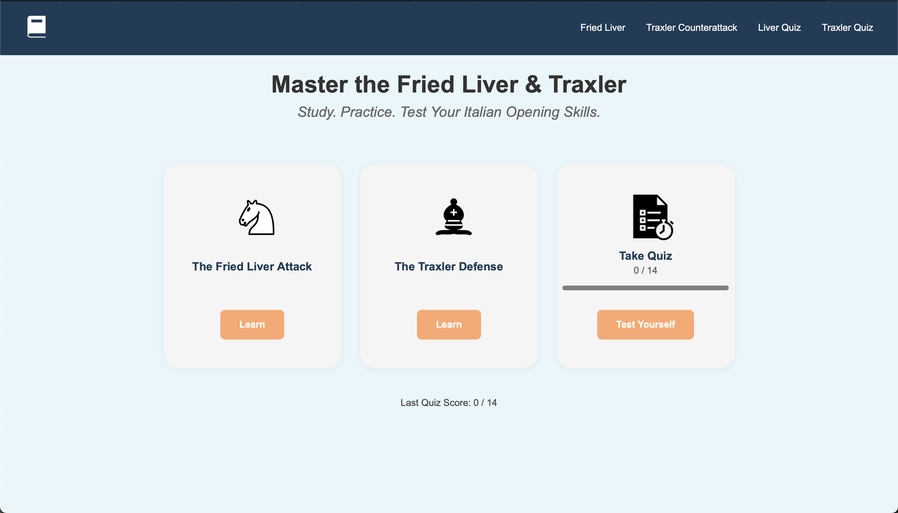
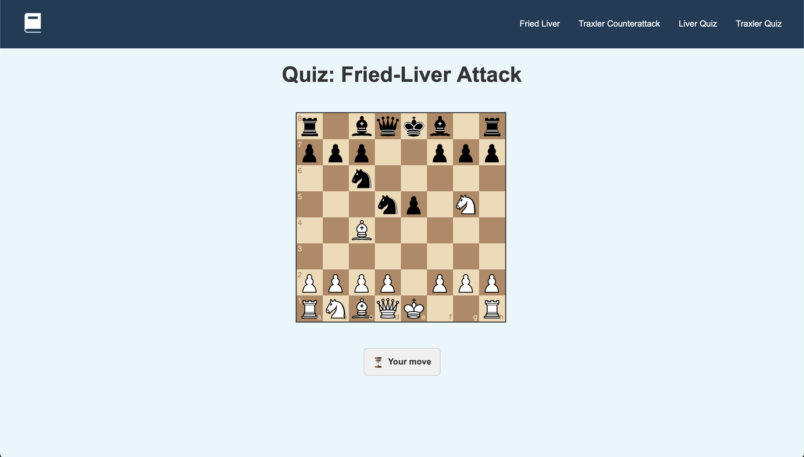

# Fried Liver and Traxler Defense Learning App

  
  

This is the Fried Liver and Traxler Defense Learning App, an interactive platform designed to help you both **learn** and **test** your skills in two of the most exciting chess openings:

- **Fried Liver Attack**: Dive deep into this aggressive Italian Opening variation. In the **Learning** section you’ll find:
  - **Move-by-move explanations** with annotated diagrams
  - **Key ideas and tactical motifs** highlighted
  - **Historical examples** and practical tips to spot the attack

- **Traxler Defense**: Explore Black’s counterpunch to the Italian Opening. The **Learning** section covers:
  - **Strategic plans** behind the counterattack
  - **Common traps** and how to avoid them
  - **Illustrated variations** for both sides

## Quiz Section

Once you’re familiar with the theory, head to the **Quiz** section to **test your knowledge**:

- You’ll play through the complete opening move sequences on an interactive board.
- Your **first attempt** at each move is recorded and compared against the ideal line.
- At the end, you receive a **score** showing how many moves you got right on the first try.
- Review your mistakes and revisit the Learning section to improve.

## Created by

- **Jacob Million** (Primarily quiz section and backend)  
- **Kevin Gutierrez** (Primarily learning section and frontend)
